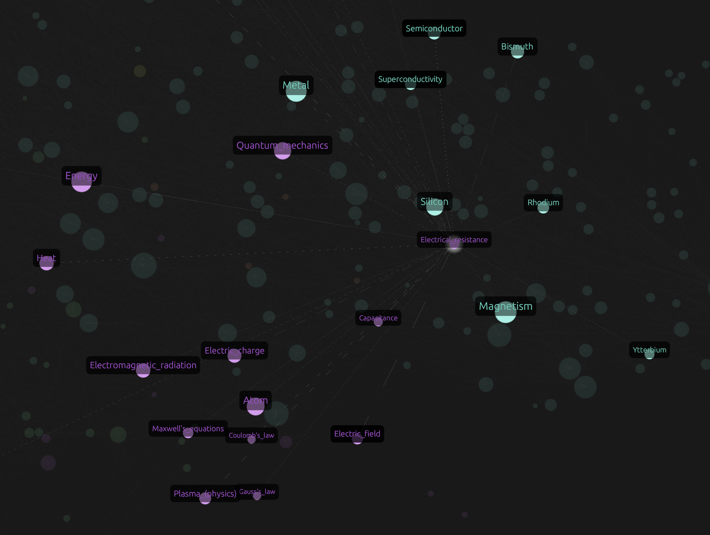

# Rebar - High Performance Graph Visualization Engine



Rebar is a high-performance, GPU-accelerated graph visualization tool written in Rust. It is designed to handle large-scale graphs (100k+ nodes) with real-time force-directed layout and interactive exploration features.

You can think of Rebar like a [Gephi](https://github.com/gephi/gephi), with a focus on preformance and ease of use.

## Features

### Core Rendering & Layout
*   **GPU Rendering**: Utilizes `wgpu` for efficient rendering of massive node and edge sets.
*   **Force-Directed Layout**: Implements **ForceAtlas2** and **Fruchterman-Reingold** algorithms for organic graph layout.
*   **Multithreaded Architecture**: Physics simulation runs on a background thread to ensure a smooth UI (60+ FPS).
*   **Spatial Indexing**: QuadTree-based spatial indexing for efficient interaction and layout optimization (Barnes-Hut).

### Advanced Visualization
*   **Community Detection**: Integrated **Leiden Algorithm** for fast and high-quality community detection.
*   **Community Visualization**: Color nodes by community, filter by community size, and toggle visibility of individual communities.
*   **Text Rendering**: Zoom-aware and degree-aware text scaling for node labels. 
*   **Visual Customization**: Adjustable node size, edge width, opacity, and color schemes.

### Interaction & Filtering
*   **Interactive Selection**: Click to select nodes, drag to move them. Persistent highlighting of neighbors upon selection.
*   **Refined Hover**: "Peek" at other nodes while maintaining your primary selection.
*   **Filtering**: Interactive histograms for filtering nodes by **Degree** and **Community Size**. Filtered nodes are excluded from both rendering and physics.

## Getting Started

### Prerequisites
*   **Rust**
*   **Vulkan/Metal/DX12**: A GPU that supports `wgpu`. (Tested on M4 Macbook Air)

### Installation
Clone the repository:
```bash
git clone https://github.com/yourusername/rebar.git
cd rebar
```

### Running the Application
Run the application with a graph file:
```bash
cargo run --release -p rg_app -- path/to/graph.txt
```

If no file is provided, it will generate a random test graph.

### Supported Data Formats
*   **Edge List (.txt)**: Space-separated source and target IDs.
    ```text
    0 1
    1 2
    2 0
    ```
*   **TSV (.tsv)**: Tab-separated values, supports string IDs.
    ```text
    NodeA	NodeB
    NodeB	NodeC
    ```

## Controls

### Mouse
*   **Left Click**: Select a node.
*   **Left Drag (Background)**: Pan the camera.
*   **Left Drag (Node)**: Move the node.
*   **Scroll**: Zoom in/out.
*   **Click (Background)**: Clear selection.

### UI Panels
*   **Layout**: Control physics parameters (Gravity, Temperature, etc.) and pause/resume simulation.
*   **Visuals**: Adjust node/edge scaling, toggle labels, and highlighting options.
*   **Communities**: Run detection, view community list, and toggle visibility.
*   **Filters**: Filter nodes by degree or community size using interactive histograms.

## Architecture
Rebar is built as a Cargo workspace with three main crates:
*   `rg_core`: Graph data structures, algorithms (Leiden), and spatial indexing (QuadTree).
*   `rg_render`: WGPU rendering backend (points, lines, instances).
*   `rg_app`: Main application logic, UI integration (`egui`), and event handling.

## License
[MIT License](LICENSE)
